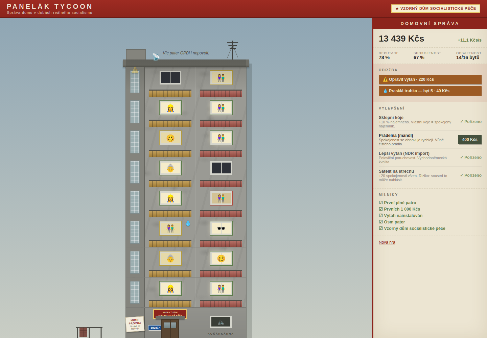

# Panelák Tycoon

> Postavte a spravujte panelák v Československu 80. let. Vybírejte nájem,
> opravujte výtah, přežijte domovní schůzi.

An idle/management browser game: you run a prefab apartment block (panelák) in
1980s Czechoslovakia. Free, static, no backend, no accounts, no monetization.
Game content is intentionally in Czech — it's part of the identity. Code,
comments and identifiers are in English.

Built per [spec.md](spec.md), now well past the MVP — see
[ROADMAP.md](ROADMAP.md) for the full version history (currently **v0.8
"Pětiletka"**).



## Quick start

```bash
npm install
npm run dev        # → http://localhost:5173
```

Other scripts:

```bash
npm test           # vitest — economy, tick reducer, events, offline calc
npm run lint       # eslint
npm run build      # typecheck + production build into dist/
npm run preview    # serve the production build locally
```

Requires Node 18+ for local dev (the Docker build uses Node 20).

## How it plays

- Occupied flats pay rent (Kčs) every second; happiness scales the income
  (never below a 0.2× trickle — you can always dig yourself out).
- Impatient comrades can click **Akce Z** ("voluntary" community work): each
  click earns a few Kčs and costs elán, which regenerates over time. It gives
  the first minutes an active lane while rent compounds.
- Milestones pay a cash bonus from OPBH, and a fresh house fills with tenants
  faster (the waiting list is long) — the early game moves.
- A how-to overlay opens on a new game; the **?** button in the header brings
  it back. The side panel keeps a short house chronicle (kronika) of recent
  events.
- Tenants move in on their own, each of **10 archetypes** with a quirk: the
  pensioner never leaves but drags down the floor's mood, the vekslák pays
  1.5× but attracts the StB, pan Lojza throws parties, the kutil fixes leaks
  for free (and drills on Saturdays), the disident earns the house a
  solidarity bonus if he survives long enough.
- From 3 floors up you can hire **pan Fanda the caretaker**: he takes a wage
  and quietly pays for + performs repairs himself.
- The **courtyard (dvorek)** is a second build dimension: sandbox, benches,
  garden beds, dryer, garage — each rendered in the scene, each with its own
  events (stolen tomatoes, football through a window, lost dog Azor).
- The tenant card shows a diagnosis of everything pushing a tenant's mood up
  or down — and a **"podat návrh na výpověď"** button (paid, slow, costs
  reputation; paní Vlasta is officially un-evictable).
- A **calendar** runs underneath (one day = 30 s, the game starts on
  1. dubna 1983): winters drain heating money and freeze radiators, every
  July 1st brings the planned hot-water outage, Christmas sweetens the house
  and on May Day the entrance decoration is… expected.
- Tenants file **requests** (dog permits, rent deferrals, a hallway light
  bulb) you approve or refuse, and the vekslák leaves **bony** you can spend
  in the **Tuzex** catalogue: a colour TV, a western washing machine, digital
  watches for the caretaker.
- Money never runs out of purpose: **Modernizace** upgrades repeat endlessly
  with escalating prices (+5 % rent per level of bytová jádra renovation),
  and once the calendar hits **1990** you can privatize the house — a
  prestige reset that pays **kupóny** for permanent perks (cheaper concrete,
  committee connections, family silver…) plus +5 % rent per era.
- Finish all 8 floors and OPBH allots another plot: up to **three paneláky**
  (U Fabriky pays more but smokes, U Lesa is idyllic but remote), switched
  with tabs above the scene. The **kádrový posudek** tracks 8 badges that
  survive every privatization — each worth a kupón.
- Full **English toggle** (EN/CZ button in the header — proper nouns stay
  Czech, that's the identity), procedural **sound effects** via Web Audio
  (no asset files, mutable with 🔊), and elections, funfairs and furniture
  moving among the events.
- The calendar paints the scene: **snow on the roof in winter** (with
  snowfall), greener summers, brown autumns. A **hall of fame** tracks
  records across eras, and the save can be **exported/imported** as a
  clipboard-friendly blob. CI attaches an itch.io-ready web zip.
- Late game is a game too: the committee issues rotating **five-year-plan
  tasks** with deadlines and rewards, every flat can be **renovated** to
  level 3 (better rent, happier tenant, nicer window), and three
  **mega-projects** — grocery, kindergarten, House of Culture — stand on the
  estate green once you can afford them. Privatization is visible on the
  notice board from day one.
- The elevator exists from the 3rd floor up and breaks down regularly. Hot
  water outages cannot be repaired, only waited out. ("Teplá voda nepoteče.
  Důvod: nepoteče.")
- Spend money on new floors (up to 8), repairs and four upgrades. The soft win
  is the facade plaque **Vzorný dům socialistické péče**: all 16 flats
  occupied at ≥80 % average happiness.
- Closing the tab is fine — offline progress accrues at 50 % rate, capped at
  8 hours. The save lives in `localStorage` (versioned schema, auto-saved
  every tick).

## Architecture

```
src/
  game/        pure TypeScript, ZERO React imports
    types.ts        all interfaces (GameState is the single source of truth)
    economy.ts      every cost curve and tuning constant in one place
    tick.ts         pure tick(state): state reducer, runs once per second
    events.ts       declarative event defs { id, weight, condition, apply }
    tenants.ts      archetype table + move-in logic
    offline.ts      pure offline fast-forward (50 % rate, 8 h cap)
    rng.ts          seedable mulberry32 — the seed lives in GameState
    state.ts        initial state factory + shared pure helpers
    content.cs.ts   ALL Czech strings, names, flavor text
    store.ts        zustand store + persist (the only impure layer)
  components/  React renders state, dispatches actions, nothing else
  styles/      single global.css — the whole panelák is CSS + SVG + emoji
```

The hard rule from the spec: `game/` contains no React and no side effects.
`tick()` advances the world deterministically from `(state, seed)` — which is
why the economy has real unit tests instead of hopes and prayers.

## Deployment

Multi-stage Docker build (node → nginx static, final image ≈ 50 MB nginx:alpine
base + ~200 kB of assets):

```bash
docker compose up --build    # → http://localhost:8080
```

For a real deployment behind Traefik: set your domain in the
`traefik.http.routers.panelak.rule` label in
[docker-compose.yml](docker-compose.yml), uncomment the external `web` network
block, and drop the `ports:` mapping. A healthcheck is built into the image.

CI ([.github/workflows/ci.yml](.github/workflows/ci.yml)) runs lint + tests +
build + docker build on every push; pushing the image to a registry is left as
a commented template.

## Tuning

Every number that matters lives in
[src/game/economy.ts](src/game/economy.ts) — rent rates, cost curves, event
chances, happiness physics. Pacing targets: first upgrade ~30 s, first new
floor ~2–3 min, full 8-floor building in ~2–3 hours of mixed play.

## Roadmap

Full version history and what's next live in [ROADMAP.md](ROADMAP.md). Shipped
through **v0.8 "Pětiletka"**: sound and an English toggle (v0.6), seasons and a
hall of fame (v0.7), the *privatizace* prestige loop (v0.4), up to three
paneláky with a kádrový posudek (v0.5), and a five-year-plan late game with
flat renovations and mega-projects (v0.8).

Next up: a **desktop / Steam build** (a Tauri wrapper so the game ships as a
downloadable executable) and further content.
